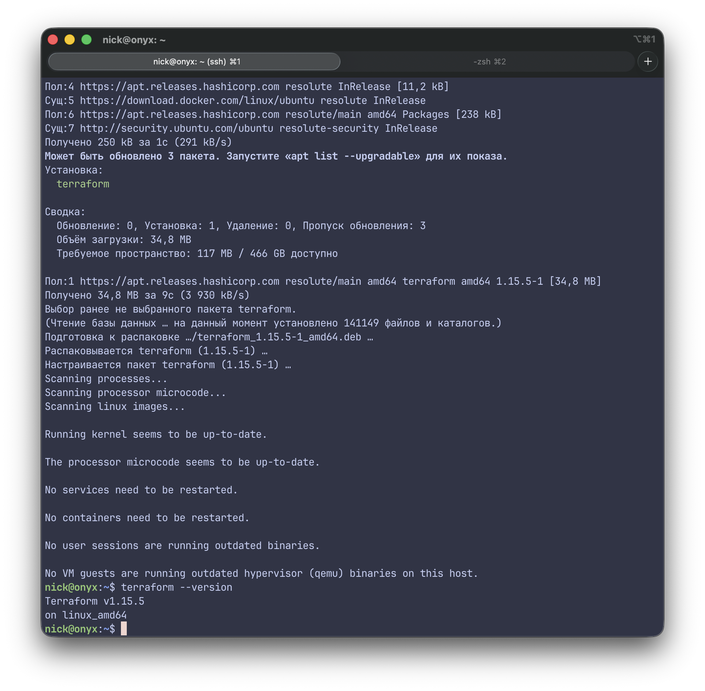
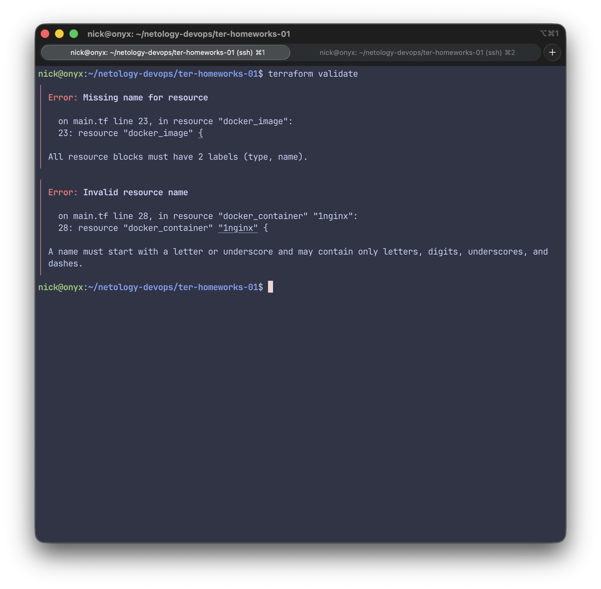
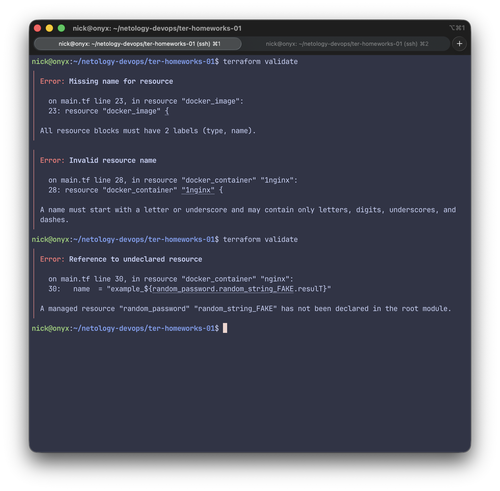
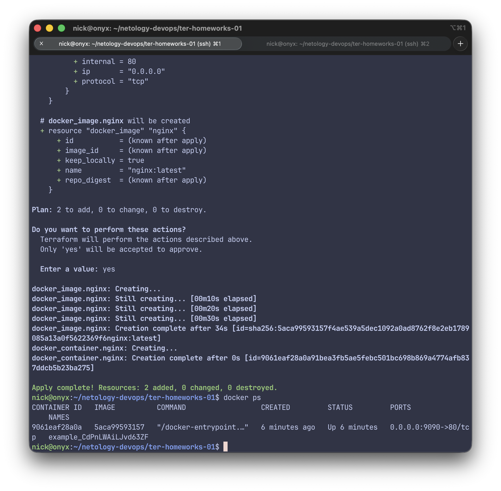
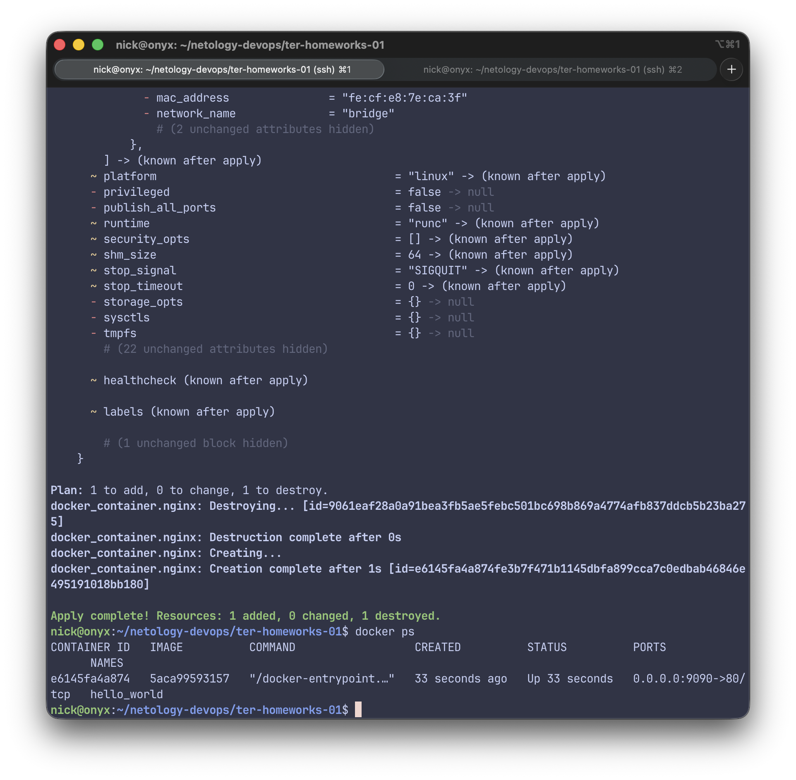
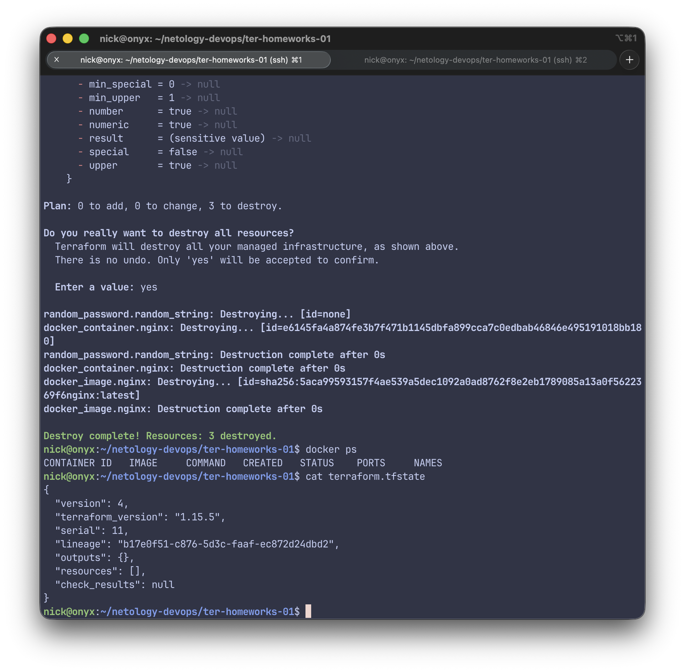

# Домашнее задание к занятию «Введение в Terraform»

## Задание 1

Согласно приложенному .gitignore допустимо сохранить личную, секретную информацию в файле personal.auto.tfvars

После выполнения terraform apply в state-файле для ресурса random_password.random_string создался ключ "result": "CdPnLWAiLJvd63ZF"

После расскоментирования блока кода при terraform validate получаем следующие ошибки:

У ресурса docker_image необходимо задать имя, например resource "docker_image" "nginx".<br>
В принципе VScode и так подсвечивал эту ошибку.

Имя ресурса docker_container "1nginx" недопустимо. Имя ресурса не может начинаться с цифры. Исправим на "nginx".

После исправления этих ошибок получаем еще одну:

Внутри docker_container используется random_password.random_string_FAKE.resulT — такого ресурса нет <br>
Исправляем на random_password.random_string.result

Исправленный фрагмент:

```hcl
resource "docker_image" "nginx" {
  name         = "nginx:latest"
  keep_locally = true
}

resource "docker_container" "nginx" {
  image = docker_image.nginx.image_id
  name  = "example_${random_password.random_string.result}"

  ports {
    internal = 80
    external = 9090
  }
}
```
Вывод docker ps:

Согласно заданию меняем имя контейнера на "hello_world"

```hcl
resource "docker_container" "nginx" {
  image = docker_image.nginx.image_id
  name  = "hello_world"

  ports {
    internal = 80
    external = 9090
  }
}
```
Вывод docker ps:

Опасность ключа -auto-approve в том, что он автоматически подтверждает выполнение плана без ручного согласия пользователя. Это может привести случайному удалению или изменению ресурсов

Ключ может использоваться в CI/CD пайплайнах, в скриптах и инструменты оркестрации.
При применении плана, уже проверенного ранее (например, после terraform plan -out=file и ручного просмотра).

Уничтожаем ресурсы при помощи terraform destroy и проверяем удаление ресурсов

Докер образ nginx:latest не был удален потому что при описании ресурса указан ключ keep_locally = true<br>
Описание ключа из официальнной документации:<br>
```
keep_locally (Boolean) If true, then the Docker image won't be deleted on destroy operation. If this is false, it will delete the image from the docker local storage on destroy operation.
```
